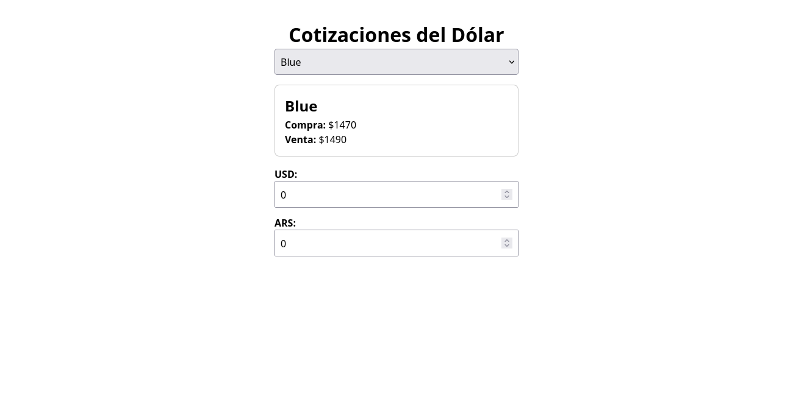

# Projects

## Oralik - Dentistry booking app


- **Project:** Oralik - a Calendly-style appointment & availability app
- **My role:** Solo developer (design, frontend, backend, deployment)
- **Stack:** React Native + Expo (mobile UI), Firebase Auth + Firestore (backend & realtime), Expo Notifications
- **Timeline:** MVP in ~8 weeks (iterative improvements afterwards)

### Summary

Oralik is a mobile-first appointment booking app that separates professionals and patients, lets professionals set weekly availability ranges (like Calendly), and automatically generates 30-minute booking slots that patients can reserve. Built as a production-ready prototype to demonstrate reliable scheduling, role-based flows, and realtime syncing without shipping the source code.

### Problem

Small businesses and independent professionals need a simple way to publish availability and let clients book slots, but many solutions were overkill or too expensive. My team and I wanted to build a focused, mobile-first solution that handles:

- role-based auth (professional vs. patient)

- recurring weekly availability windows (e.g., Mon 09:00–13:00)

- automatic slot generation (30-min) with conflict resolution and realtime updates

### Key features / Solution

- **Role-based authentication:** Sign up / sign in with Firebase Auth; users choose professional or patient role.

- **Availability model:** Professionals set day-of-week ranges (start/end, buffer times, exceptions).

- **Automatic slot generator:** Converts ranges into 30-minute bookable slots, prevents overlaps and respects existing appointments.

- **Booking flow:** Patients select a professional, view available slots in a compact calendar, confirm booking.

- **Realtime updates:** Firestore listeners keep availability and bookings synced across devices.

- **Polished UX:** Mobile-friendly flows, clear error handling, local caching for snappier UX.

### Implementation highlights (non-confidential)

**Data model (high level)**

- `users/{id}` - profile + role

- `professionals/{id}/availability` - weekly ranges + exceptions

- `professionals/{id}/appointments/{appointmentId}` - booked slots

**Slot generation (pseudo-code)**

```javascript
    for each availability_range on day:
        t = availability_range.start
        while t + SLOT_DURATION <= availability_range.end:
            if no existing_appointment_conflict(t, t + SLOT_DURATION):
                add slot(t)
            t = t + SLOT_DURATION
```

**Realtime & consistency**

- Bookings written with transactional checks (Firestore transactions) to avoid race conditions.

- UI uses optimistic updates with rollback on conflict for perceived snappiness.

### Challenges & how I solved them

- Overlapping availability / double-booking - used Firestore transactions and defensive checks before confirming bookings.

- Edge cases (midnight spans, short windows) - normalized ranges to local timezone, validated minimum slot size, and surfaced clear UI messages.

- Mobile UX for many slots - implemented paginated day view + “next available” quick jump.

### What this demonstrates to an employer

- End-to-end product sense: requirement → architecture → shipped MVP.

- Full-stack competence with mobile UI + backend realtime systems.

- Practical problem solving: scheduling algorithms, data modelling, transactional consistency.

- Ability to work independently and document technical tradeoffs.

### Results / Next steps

- MVP stable in local testing; ready for pilot with 1–2 real professionals.

- Next: payment integration, timezone-aware external calendar sync (Google/Outlook), and a small admin dashboard.

## Calcudolar - Conversion app



- **Project:** Calcudolar - Front-end currency converter
- **Role:** Solo developer - Front-end (React + Vite)
- **Stack:** React (hooks), Vite, dolarApi (public exchange rates API), Netlify / Vercel (deployment), CSS modules / plain CSS

### Summary

Calcudolar is a lightweight, mobile-friendly currency conversion tool built as a front-end only app. It fetches exchange rates from `dolarApi` and gives users a fast, simple interface to convert ARS to USD (at different exchange rates). The goal was a tiny, reliable tool that’s pleasant to use on phones and that demonstrates clean React patterns and API integration.

**Live demo:** https://calcudolar.vercel.app; Code: https://github.com/JuanMartinRivas/calcudolar

### Problem & goal

Many currency widgets are bloated or slow. I wanted a single-purpose, ultra-fast converter that:

- Queries a trusted rates endpoint (dolarApi).

- Gives instant conversions with clear input / output UX.

- Works well on mobile (fast, accessible, minimal data usage).

- Serves as a public front-end sample showing good React architecture.

### Solution overview

- A responsive single-page React app that fetches the latest rates and calculates conversions client-side.

- Minimal UI: amount input, currency selector, live result, and small history of recent queries.

- Defensive fetching with error handling and caching to reduce API load and improve perceived speed.
